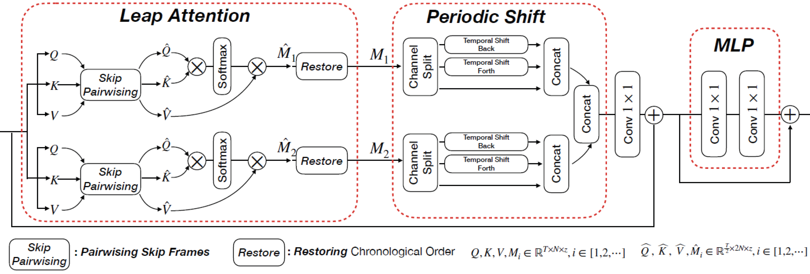

# VideoNetworks (Version 2)
This is official implementation (ver2.0) of VideoNet, containing the following models:
* 2022 ACM Multimedia Oral Paper "LAPS: Long-term Leap Attention, short-term Periodic Shift for Video Classification" [`Paper link`](https://arxiv.org/abs/2207.05526).
<div align="center">
  
</div>

* 2021 ACM Multimedia Paper "Token Shifit Transformer for Video Classification". We build an a pure-convolutional free video transformer and achieve SOTA performance 80.53% on Kinetics-400 [`Paper link`](https://arxiv.org/abs/2108.02432).
<div align="center">
  
</div>

- [Updates](#updates)
- [Model Zoo and Baselines](#model-zoo-and-baselines)
- [Installation](#installation)
- [Quick Start](#quick-start)
- [Contributors](#contributors)
- [Citing](#citing)
- [Acknowledgement](#Acknowledgement)

## Updates
### Sept. 16, 2022
* Release LAPS to public.
* Release this the 2nd version of TokShift to public.
* Ver2 includes the following modifications:
  - Directly decode video mp4 file during training/evaluation
  - Change to adopt standarlize timm code-base.
  - Performances of TokShift are further improved than reported in paper version (average +0.5).

## Model Zoo and Baselines
We present experimental comparion between verion 1.0 and 2.0 in [Model Zoo](MODEL_ZOO.md)

## Installation
```
conda create -n tokshift python=3.7
conda activate tokshift
pip install torch==1.9.0+cu111 torchvision==0.10.0+cu111 torchaudio==0.9.0 -f https://download.pytorch.org/whl/torch_stable.html
pip install -r requirements (or pip install -i https://pypi.tuna.tsinghua.edu.cn/simple -r requirements)
```

## Quick Start
### Training 
1. Donwload Kinetics-400 datasets
2. Re-organize the Kinetics-400 dataets in the following structure. ([structure files](page)), use rename.py to remove space " " in category name.
3. Set-up Wandb according to https://docs.wandb.ai/quickstart#1.-set-up-wandb
```
kinetics400_mmlab
|_train.csv
|_val.csv
|_test.csv
|_cate_dict.json
|_process
|_val
|   |_[category name 0]
|   |   |_[video name 0].mp4
|   |   |_[video name 1].mp4
|   |   |_[video name 2].mp4
|   |   |_...
|   |_[category name 2]
|   |   |_[video name 0].mp4
|   |   |_[video name 1].mp4
|   |   |_[video name 2].mp4
|   |   |_...
|   |_...
|_train
    |_[category name 0]
    |   |_[video name 0].mp4
    |   |_[video name 1].mp4
    |   |_[video name 2].mp4
    |   |_...
    |_[category name 2]
    |   |_[video name 0].mp4
    |   |_[video name 1].mp4
    |   |_[video name 2].mp4
    |   |_...
    |_...
```
3. Use train script (train.sh under ./scripts) to trian k400
```
#!/usr/bin/env python
import os

# Visformer_LAPS_8x8
cmd = "python -u main_tokshift.py \
               --multiprocessing-distributed --world-size 1 --rank 0 \
               --dist-ur tcp://127.0.0.1:23677 \
 	       --tune_from pretrain/visformer_s_in10k.pth \
               --cfg_file config/custom/k400/visformer/visformer_LAPS_8x8.yaml"
os.system(cmd)

cmd = "python -u main_tokshift.py \
               --multiprocessing-distributed --world-size 1 --rank 0 \
               --dist-ur tcp://127.0.0.1:23677 \
               --cfg_file config/custom/k400/tokshift_8x32_b16.yaml"
os.system(cmd)

```
### Test with eval.sh
```
#!/usr/bin/env python
import os

cmd = "python -u main_tokshift.py \
               --multiprocessing-distributed --world-size 1 --rank 0 \
               --dist-ur tcp://127.0.0.1:23677 \
               --eval \
               --resume checkpoints/TokShift_vit_base_patch16_224_in21k_kinetics_C400_8x32_E18_LR0.06_B6_S224/best_ckpt_e17.pth \
               --cfg_file config/custom/k400/tokshift_8x32_b16.yaml"
os.system(cmd)
```
## Contributors
VideoNet is written and maintained by [Dr. Hao Zhang](https://hzhang57.github.io/) and [Dr. Yanbin Hao](https://haoyanbin918.github.io/).

## Citing
If you find TokShift-xfmr is useful in your research, please use the following BibTeX entry for citation.
```BibTeX
@inproceedings{zhang2022leap,
  title={Long-term Leap Attention, short-term Periodic Shift for Video Classification},
  author={Zhang, Hao and Cheng, Lechao and Hao, Yanbin and Ngo, Chong-Wah},
  booktitle={Proceedings of the 30th ACM International Conference on Multimedia},
  year={2022}
}
```
```BibTeX
@inproceedings{zhang2021token,
  title={Token Shift Transformer for Video Classification},
  author={Zhang, Hao and Hao, Yanbin and Ngo, Chong-Wah},
  booktitle={Proceedings of the 29th ACM International Conference on Multimedia},
  pages={917--925},
  year={2021}
}
```
## Acknowledgement
Thanks for the following Github projects:
- https://github.com/rwightman/pytorch-image-models
- https://github.com/jeonsworld/ViT-pytorch
- https://github.com/mit-han-lab/temporal-shift-module
- https://github.com/amdegroot/ssd.pytorch
- https://github.com/pytorch/examples/tree/master/imagenet
